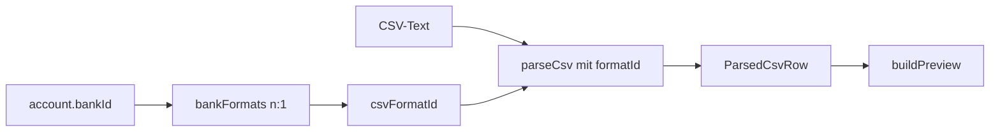
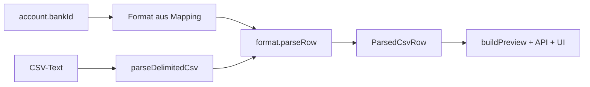
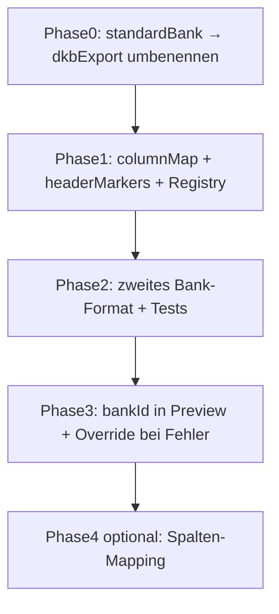

# Multi-Bank CSV-Import vorbereiten

## Bestehender Stand: DKB-Export (nicht generisch)

**Wichtig:** Das aktuelle Parse-Modul [`formats/standardBank.ts`](src/lib/csvImport/formats/standardBank.ts) ist faktisch der **DKB-Kontoumsatz-Export** – Spalten `Buchungsdatum`, `Status`, `Zahlungspflichtige*r`, `Zahlungsempfänger*in`, `Verwendungszweck`, `Umsatztyp`, `Betrag (€)`, Metadaten `Zeitraum:` oben, führende Leerspalten. Der Name `standardBank` / „Standard-Bankexport“ ist irreführend.

**Erster Schritt bei Umsetzung:** Umbenennen zu `dkbExport`:

| Alt | Neu |
|-----|-----|
| `formats/standardBank.ts` | `formats/dkbExport.ts` |
| `CsvImportFormatId: 'standardBank'` | `'dkbExport'` |
| `label: 'Standard-Bankexport'` | `'DKB Kontoumsätze'` |
| `standardBank.test.ts` | `dkbExport.test.ts` |

Initial-Mapping in `bankFormats.ts` – **nur DKB**, andere Banken erst nach eigenem Format-Modul:

```typescript
export const BANK_CSV_FORMAT: Partial<Record<GermanBankId, CsvImportFormatId>> = {
  dkb: 'dkbExport',
  // ing: 'ingExport',     // erst wenn Modul existiert
  // sparkasse: 'sparkasseExport',
}
```

Bis ein Format existiert: Import für diese Bank mit klarer Meldung blockieren („CSV-Import für [Bank] noch nicht unterstützt“), **nicht** fälschlich DKB-Parser anwenden.

---

## Entscheidung: Hybrid (Einstellungen + Code-Module)

**Gewählt:** TypeScript-Module pro **CSV-Format** (nicht pro Bank), Auswahl primär über **`account.bankId`** aus den Einstellungen ([`germanBanks.ts`](src/lib/germanBanks.ts), [`settings/page.tsx`](src/app/settings/page.tsx)). **n:1** – mehrere Banken können dasselbe Format teilen (z. B. Sparkasse/Volksbank).

Auto-Detect bleibt optional als **Sanity-Check** (Header passen nicht → Warnung), nicht als primärer Auswahlmechanismus.



Neues Mapping z. B. [`src/lib/csvImport/bankFormats.ts`](src/lib/csvImport/bankFormats.ts):

```typescript
export const BANK_CSV_FORMAT: Partial<Record<GermanBankId, CsvImportFormatId>> = {
  dkb: 'dkbExport',
  // weitere Banken → eigenes Format-Modul, dann hier eintragen
}
```

---

## Ausgangslage

Die Architektur ist **größtenteils erweiterbar** – der Engpass liegt nicht in Preview/Duplikat/Wiederkehrend, sondern in der **Parse-Schicht**:



| Schicht | Bank-spezifisch? | Status |
|---------|------------------|--------|
| [`parseDelimited.ts`](src/lib/csvImport/parseDelimited.ts) | Delimiter, Quotes, führende Leerspalten | Generisch |
| [`headerDetection.ts`](src/lib/csvImport/headerDetection.ts) | **Ja** – Marker fest `"buchungsdatum"` | Blockiert andere Banken |
| [`formats/dkbExport.ts`](src/lib/csvImport/formats/standardBank.ts) *(aktuell fälschlich `standardBank`)* | DKB-Spalten, Umsatztyp-Logik, Status, `Zeitraum:`-Metadaten | **Ein Format – DKB** |
| [`parseDate.ts`](src/lib/csvImport/parseDate.ts) / [`parseAmount.ts`](src/lib/csvImport/parseAmount.ts) | DE-Locale | Erweiterbar |
| [`dateRange.ts`](src/lib/csvImport/dateRange.ts) | `Zeitraum:`-Metadaten | **DKB-spezifisch** (später pro Format-Hook) |
| [`buildPreview.ts`](src/lib/csvImport/buildPreview.ts), Commit, UI | Nein – arbeiten nur mit `ParsedCsvRow` | Bereit |

Das Interface in [`types.ts`](src/lib/csvImport/types.ts) ist der richtige Anker:

```typescript
export type CsvImportFormat = {
  id: CsvImportFormatId
  label: string
  detect: (headers: string[]) => boolean
  parseRow: (row: Record<string, string>, rowIndex: number) => ParsedCsvRow
}
```

**Wichtig:** Alles nach `parseRow` (Händler-Matching, Duplikate, Wiederkehrend, Sortierung) bleibt unverändert, solange jede Bank auf dasselbe interne Modell mappt:

- `date`, `amount` (Vorzeichen: Ausgabe negativ)
- `merchantRaw`, `description`
- `isConfirmed` (CSV „gebucht“ vs. „vorgemerkt“)
- `errors[]`

---

## Phase 1: Format-Registry und gemeinsame Bausteine (Foundation)

**Ziel:** Neue Bank = neues Modul + eine Zeile in der Registry, ohne Copy-Paste.

### 1.1 Shared Column-Mapping extrahieren

Die Hilfsfunktionen in [`dkbExport.ts`](src/lib/csvImport/formats/standardBank.ts) *(Rename)* (`normalizeHeader`, `findColumnKey`, `getCell`) nach [`src/lib/csvImport/columnMap.ts`](src/lib/csvImport/columnMap.ts) verschieben.

Neues deklaratives Hilfs-API für Formate:

```typescript
// Spalten-Aliase pro semantischem Feld
const columns = {
  date: ['Buchungsdatum', 'Buchungstag', 'Datum'],
  amount: ['Betrag (€)', 'Betrag', 'Umsatz'],
  // ...
}
export function requiresColumns(headers: string[], fields: string[][]): boolean
export function mapRowWithColumns(row, columns, map): ParsedCsvRow
```

[`dkbExport.ts`](src/lib/csvImport/formats/dkbExport.ts) bleibt DKB-spezifisch: Spalten-Aliase + Umsatztyp → Händler/Betrag + `parseMetadata` für `Zeitraum:`.

### 1.2 Format-Registry + Bank-Mapping

[`index.ts`](src/lib/csvImport/index.ts) erweitern:

- `FORMATS`-Array: Code-Module pro **Export-Layout** (nicht pro Bank)
- `getCsvFormatForBank(bankId): CsvImportFormat | null` über [`bankFormats.ts`](src/lib/csvImport/bankFormats.ts)
- `parseCsv(csvText, { formatId?, bankId? })` – **primär** `formatId` aus `bankId`; `formatId`-Override nur bei Fehler/Manuelle Korrektur
- Fehlermeldung wenn `bankId` fehlt oder kein Mapping existiert: „Bitte Bank in den Einstellungen wählen“
- `detect(headers)` nur zur **Validierung**: Header passen nicht zum gewählten Format → klare Warnung in Preview

`CsvImportFormatId` in [`types.ts`](src/lib/csvImport/types.ts): Union-Typ nach Export-Layouts (`'dkbExport' | 'ingExport' | …`), nicht nach Bank-IDs. **`dkbExport` ist das bisherige einzige Format.**

### 1.3 Header-Erkennung formatfähig machen (kritisch)

**Problem:** [`headerDetection.ts`](src/lib/csvImport/headerDetection.ts) sucht global nach `"buchungsdatum"`, bevor ein Format gewählt ist. Andere Banken nutzen z. B. `"Valuta"`, `"Booking Date"`, `"Auftragskonto"`.

**Lösung:** `CsvImportFormat` um optionale Hooks ergänzen:

```typescript
export type CsvImportFormat = {
  // ... bestehend
  /** Kopfzeilen-Marker (normalisiert verglichen) – mindestens einer muss in der Zeile vorkommen */
  headerMarkers?: string[]
  /** Optional: Metadaten-Zeilen vor der Tabelle (Zeitraum etc.) */
  parseMetadata?: (csvText: string) => ImportDateRange | null
  /** Optional: Zeilen überspringen (Summen, leere Zeilen) */
  skipRow?: (row: Record<string, string>) => boolean
}
```

[`parseDelimited.ts`](src/lib/csvImport/parseDelimited.ts) refactoren:

1. Alle registrierten `headerMarkers` sammeln (Union aller Formate)
2. Erste passende Zeile als Header wählen (weiterhin Delimiter + Spalten-Offset)
3. Danach `detect(headers)` ausführen

Fallback: erste Zeile mit genügend Spalten, wenn kein Marker passt (mit klarer Fehlermeldung).

### 1.4 Locale-Parser erweitern

[`parseDate.ts`](src/lib/csvImport/parseDate.ts) und [`parseAmount.ts`](src/lib/csvImport/parseAmount.ts):

| Variante | Beispiel | Funktion |
|----------|----------|----------|
| DE (bestehend) | `15.03.2026`, `-1.234,56 €` | `parseGermanDate`, `parseGermanAmount` |
| ISO | `2026-03-15` | `parseIsoDate` (neu) |
| US/EN | `3/15/2026`, `1,234.56` | `parseUsDate`, `parseUsAmount` (neu) |

Formate wählen explizit ihre Parser – keine globale Locale-Annahme.

[`dateRange.ts`](src/lib/csvImport/dateRange.ts): `parseZeitraumFromCsv` bleibt Default-Hook; Formate mit anderem Metadaten-Format implementieren `parseMetadata` und `getImportDateRange` ruft zuerst format-spezifisch auf, dann generischen Fallback (Min/Max der Zeilen).

---

## Phase 2: Zweites Format als Proof-of-Concept

**Ziel:** Architektur validieren – **DKB (`dkbExport`) ist bereits live** und wird nur umbenannt/zugeordnet. Phase 2 fügt das **erste weitere** Bank-Format hinzu.

Empfohlener Kandidat: nächste Bank, die ihr unterstützen wollt (z. B. ING, Sparkasse, N26) – mit anonymisierter Sample-CSV als Fixture.

- [`src/lib/csvImport/formats/<formatId>.ts`](src/lib/csvImport/formats/) – `detect`, `parseRow`, ggf. `headerMarkers`, `parseMetadata`
- [`src/lib/csvImport/<formatId>.test.ts`](src/lib/csvImport/) – Fixture aus echter CSV (2–5 Zeilen + Metadaten-Block)
- Eintrag in `bankFormats.ts` für die jeweilige `bankId`(s)

Typische Abweichungen gegenüber **DKB**:

| Thema | DKB (dkbExport) | Andere Banken oft |
|-------|-----------------|-------------------|
| Händler | getrennt Zahlungspflichtiger/Empfänger + Umsatztyp | eine Spalte „Begünstigter/Auftraggeber“ oder nur Verwendungszweck |
| Betrag | immer positiv + Umsatztyp | bereits vorzeichenbehaftet oder getrennte S/H-Spalte |
| Status | „Gebucht“ / „Vorgemerkt“ | „Umsatz gebucht“, leer = gebucht, separates Valuta-Datum |
| Metadaten | `Zeitraum:` oben, führende Leerspalten | Kontonummer, Saldo, andere Kopfzeilen |

**Detect-Regel:** strikt genug (Pflichtspalten-Kombination), damit Formate sich nicht gegenseitig fälschlich matchen. Bei Kollision: höhere Spezifität gewinnt oder manuelle Auswahl (Phase 3).

---

## Phase 3: UI und API (bankId-getrieben)

**Preview-API** ([`preview/route.ts`](src/app/api/transactions/import/preview/route.ts)):

- Liest `account.bankId` aus Kontext → `formatId` via Mapping
- Body optional: `formatId?: string` nur als Override
- Response: `formatId`, `formatLabel`, `bankId`, `headerMismatch?: boolean` (detect-Warnung)

**UI** ([`TransactionCsvImport.tsx`](src/components/TransactionCsvImport.tsx)):

- Zeigt: „Import für [Bankname] – Format [Label]“
- Kein Bank-Dropdown im Import (Bank steht in Einstellungen); Link „Bank in Einstellungen ändern“
- Override-Dropdown nur wenn Parse fehlschlägt oder `headerMismatch`
- Fehlermeldung wenn keine Bank gewählt: Hinweis auf Einstellungen

---

## Phase 4 (optional, später): Generisches Spalten-Mapping

Für Banken ohne festes Modul oder stark variierende Exporte:

- Preview-Schritt 1: Roh-Header anzeigen
- Nutzer mappt Spalten → `date`, `amount`, `merchant`, `description`, `status`
- Mapping pro Konto speichern (`CsvImportProfile` in DB oder Settings)
- Commit-Pipeline unverändert (weiterhin `ParsedCsvRow`)

Das ist deutlich mehr UI- und Validierungsaufwand – erst sinnvoll, wenn 2–3 feste Formate live sind und Bedarf für „Rest der Welt“ klar ist.

---

## Konventionen für neue Formate / Bank-Zuordnungen

Checkliste (in [`API.md`](API.md) oder `formats/README.md`):

1. **Neues Export-Layout:** Modul unter `formats/<formatId>.ts` + Fixture-Tests
2. **Bank hinzufügen:** eine Zeile in `bankFormats.ts` (mehrere Banken → gleiches `formatId`)
3. `headerMarkers`: alle Kopfzeilen-Bezeichnungen dieses Layouts
4. `parseRow`: signed `amount`, `merchantRaw` bei gültiger Zeile
5. `isConfirmed`: konsistent mit Duplikat-/Wiederkehrend-Flow
6. `detect`: für Validierung, nicht als primäre Auswahl

---

## Pflege-Anleitung: weiteres Format eintragen

**Heute (vor Umsetzung):** Ein Modul [`formats/standardBank.ts`](src/lib/csvImport/formats/standardBank.ts) = DKB; keine Bank-Auswahl, Auto-Detect auf DKB-Header.

**Nach Umsetzung des Plans:** Pro **Export-Layout** ein Code-Modul; Banken werden per Mapping zugeordnet. Du musst Preview, Duplikat, Wiederkehrend oder Commit **nicht** anfassen.

### Schritt-für-Schritt (Beispiel: ING)

**1. Sample-CSV sichern**

Anonymisierte echte Export-CSV (2–10 Zeilen + Metadaten-Kopf) als Test-Fixture, z. B. `src/lib/csvImport/fixtures/ing-sample.csv`.

**2. Format-Modul anlegen**

`src/lib/csvImport/formats/ingExport.ts`:

```typescript
export const ingExportFormat: CsvImportFormat = {
  id: 'ingExport',
  label: 'ING Kontoumsätze',
  headerMarkers: ['buchungsdatum', 'datum'],  // normalisiert
  detect: (headers) => requiresColumns(headers, COL_DATE, COL_AMOUNT, …),
  parseMetadata: (csvText) => …,  // optional, z. B. Zeitraum-Zeile
  skipRow: (row) => …,            // optional, Summenzeilen
  parseRow: (row, rowIndex) => ({
    rowIndex,
    date: parseGermanDate(getCell(row, COL_DATE)),
    amount: …,           // signed: Ausgabe negativ
    merchantRaw: …,
    description: …,
    isConfirmed: …,      // nur true → Duplikat/Wiederkehrend-Bestätigung
    umsatztyp: …,
    errors: [],
  }),
}
```

Orientierung: [`formats/dkbExport.ts`](src/lib/csvImport/formats/standardBank.ts) (Rename von DKB). Gemeinsame Hilfen aus `columnMap.ts`, Parser aus `parseDate.ts` / `parseAmount.ts`.

**3. Format-ID registrieren**

In [`types.ts`](src/lib/csvImport/types.ts):

```typescript
export type CsvImportFormatId = 'dkbExport' | 'ingExport'
```

In [`index.ts`](src/lib/csvImport/index.ts) zum `FORMATS`-Array hinzufügen:

```typescript
const FORMATS = [dkbExportFormat, ingExportFormat]
```

**4. Bank(en) zuordnen**

In `bankFormats.ts`:

```typescript
export const BANK_CSV_FORMAT = {
  dkb: 'dkbExport',
  ing: 'ingExport',
  // comdirect: 'ingExport',  // falls gleiches Layout
} satisfies Partial<Record<GermanBankId, CsvImportFormatId>>
```

Mehrere Banken → **dieselbe** `formatId`. Neue Bank in [`germanBanks.ts`](src/lib/germanBanks.ts) nur nötig, wenn sie in der UI-Auswahl fehlt.

**5. Tests schreiben**

`src/lib/csvImport/ingExport.test.ts`:

- Fixture-CSV parsen → `formatId === 'ingExport'`
- Datum, Betrag (Vorzeichen), Händler, `isConfirmed` prüfen
- Randfälle: Vorgemerkt, leere Zeilen, Metadaten-Block oben

```bash
npm test -- --run src/lib/csvImport/ingExport.test.ts
```

**6. Doku**

- [`API.md`](API.md): Spalten des neuen Formats kurz beschreiben
- Optional `formats/README.md`: Checkliste für künftige Formate

### Was du nicht anfassen musst

| Bereich | Grund |
|---------|--------|
| `buildPreview.ts`, Duplikat, Wiederkehrend | Arbeiten mit `ParsedCsvRow` |
| `import/route.ts` (Commit) | Ebenfalls format-agnostisch |
| `TransactionCsvImport.tsx` | Zeigt automatisch Bank + Format-Label aus Preview |
| Preview-API | Nutzt `account.bankId` → Mapping |

### Wann reicht kein neues Modul?

- **Gleiches Layout, andere Bank:** nur Zeile in `bankFormats.ts`
- **DKB-Layout mit minimal anderen Spaltennamen:** Aliase in `columnMap` des bestehenden Moduls erweitern, kein neues Format
- **Komplett anderes Layout:** neues Modul + neues `formatId`

### Fehler vermeiden

- `amount`: Ausgaben **negativ**, Einnahmen **positiv** (wie DKB-Logik)
- `isConfirmed: false` bei vorgemerkten CSV-Zeilen → kein Bestätigungsangebot bei Duplikat/Wiederkehrend
- `merchantRaw` nicht leer lassen, sonst schlägt Preview/Import fehl
- Bank ohne Mapping → Import blockieren, **nicht** DKB-Parser als Fallback nutzen

---

## Empfohlene Reihenfolge



**Nicht nötig:** Preview, Duplikat, Wiederkehrend oder Commit anfassen – die sind bereits format-agnostisch.

**Größter Hebel:** Header-Erkennung und gemeinsames Column-Mapping (Phase 1) – ohne das skaliert jede neue Bank mit Sonderlogik in `parseDelimited`.
